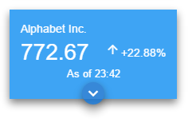

# Material Design Stock Cards

## Purpose
> These cards were originally made for use in a 'soffit' in the uPortal platform. They are created using React and CSS without any dependencies on Node or Webpack. Third party libraries include MDL and JQuery as well as the necessary Babel Transpiler. Since no back-end is required for these cards, development will continue at a slow pace.

## How to Demo
> For anyone new to React, you can get a demonstration of these cards by downloading the repository. Then, in a terminal, naviagte to the cloned directory and run the `python -m SimpleHTTPServer` command. It'll start a localHost on port 8000 by default. In a new tab in your browser type localhost:8000/main.html. You should see the cards! Enjoy!

## Screenshots

